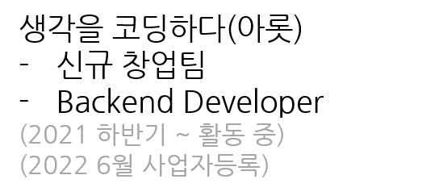

소통과 협업을 중시하며, 이것이 업무 효율성 증대 및 팀의 성장에 영향을 가져온다고 믿습니다.  
창업팀에서 외주 및 여러 활동을 수행하며 타 직종 대표님이나 박사분들과 소통해왔고 스스로도 소통하기 편한 사람이 되기 위해 노력하고 있습니다.  
좋은 팀 문화를 만들어 나가는 것에 관심이 많습니다. 팀원들과 후배들에게 정보를 공유하기 위해 블로그 및 노션을 적극 활용하고 있으며, 특히 협업을 중시해 개발산출물을 잘 관리하는것에도 관심이 많습니다.

## Personal Information.  

* **이름 : 임준호**
* **이름(영문) : Limjunho**  
* **전공 : 사이버보안전공**
* **Email : jewel7492@gmail.com**
* **Github : [https://github.com/limjunho](https://github.com/limjunho)**

## Skill.

* Language : Java, SQL
* Back-End : Spring, RESTful API
* DevOps : AWS
* Database : MySQL
* Soft-skill : Agile, XP, Waterfall

## Career.

  

* 외주 미팅 & 개발
* 요구사항 정리 및 피드백
* 팀 내의 기술부채를 문서 또는 블로그에 정리
* SQL & REST API 개발
* AWS 서버 운영

  

---

## 논문
* [`[임준호], 이영찬, 박지훈, 김대영. (2020). 신속한 대피를 위한 GPS, RSSI기반 지진 비상대피 안내 시스템. 한국정보과학회 학술발표논문집, (), 1342-1344.`](https://www.dbpia.co.kr/journal/articleDetail?nodeId=NODE09874770)
* `장재원, 이소연, 양희웅, [임준호], 이영찬, 김대영*. (2020). 딥러닝 모델을 이용한 실시간 미아 찾기 시스템. 한국인터넷정보학회 추계학술대회 논문집 제 21권2호.`
* [`김지원, [임준호], 이소연, 이영찬, 김대영. (2021). 효율적인 제설작업을 위한 제설 우선순위 결정 시스템. 한국통신학회 학술대회논문집, (), 929-930.`](https://www.dbpia.co.kr/journal/articleDetail?nodeId=NODE10547839)
* `[임준호], 이영찬, 박지훈, 이소연, 김대영*. (2021). 전염병 확산 방지를 위한 딥러닝 기반 인구분산 유도 시스템. 한국인터넷정보학회 춘계학술대회 논문집 제22권1호.`
* `장재원, 이소연, 양희웅, [임준호], 김대영*. (2021). 딥러닝 기반 긴급차량 우선 신호 시스템. ICT플랫폼학회 하계학술대회.`
* `[임준호], 이영찬, 양희웅, 장재원, 김대영*. (2021). 신속한 소방작전 설계를 위한 화재정보 수집 시스템. ICT플랫폼학회 추계학술대회`
* `[임준호], 장재원, 양희웅, 전용준*. (2022). 화재 이미지 알람 시스템 설계 및 구현. 한국정보처리학회 ASK 2022 (춘계학술대회)`

## 수상 

대구·경북 아이디어톤(2020) - SW 설계 부문 최우수상

       

  

ICT 플랫폼학회 하계 학술대회(2021) - 우수논문상

       

  

[경북테크노파크] 경북형 SW인력양성 및 일자리창출 사업 성과공유대회(2021) - 장려상

       

  

[대구가톨릭대학교] 캡스톤 디자인 EXPO(2022) - 장려상

       

.jpg)  

## 자격증

리눅스마스터 2급

       

  

네트워크 관리사 2급

       

  

